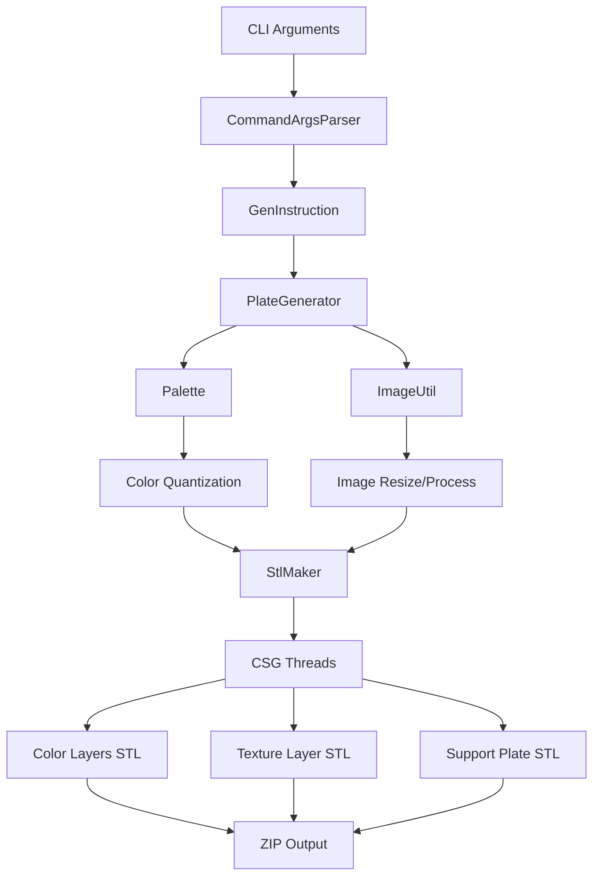

# PIXEstL Architecture Documentation

## Overview

PIXEstL is a command-line tool for creating color lithophanes for 3D printing with multi-color filaments (CMYK-based additive color mixing). This document provides a comprehensive analysis of the Java implementation to guide the Rust port.

## High-Level Architecture



## Module Breakdown

### 1. Entry Point & CLI

**Java Classes:**
- `Main.java` - Entry point
- `CommandArgsParser.java` - CLI argument parsing using Apache Commons CLI
- `GenInstruction.java` - Configuration data structure

**Responsibilities:**
- Parse CLI arguments
- Validate input parameters
- Create configuration object
- Invoke main processing pipeline

**Key Parameters:**
- Input image path, palette path
- Output dimensions (width/height in mm)
- Pixel dimensions (color pixel width, texture pixel width)
- Layer configuration (number of layers, thickness)
- Color distance method (RGB, CIELab)
- Pixel creation method (ADDITIVE, FULL)
- Thread configuration for parallel processing

### 2. Palette Module

**Java Classes:**
- `Palette.java` - Palette management and color quantization
- `ColorLayer.java` - Single color layer with CMYK values
- `ColorCombi.java` - Combination of color layers

**Responsibilities:**

#### 2.1 Palette Loading
- Load JSON palette file
- Parse filament definitions with layers
- Each filament has:
  - Hex code (e.g., `#0086D6`)
  - Name (e.g., "Cyan[PLA Basic]")
  - Active flag
  - Layers (1-5) with HSL or hex values

#### 2.2 Color Combination Generation
**Algorithm for ADDITIVE mode:**
1. Read all active filaments from palette
2. For each filament, extract layers (1-5) with HSL values
3. Convert HSL → CMYK for each layer
4. Generate all possible combinations that sum to `colorPixelLayerNumber` layers (default: 5)
5. Compute final color by:
   - Sum CMYK values of all layers in combination
   - Clamp CMYK values to [0, 1]
   - Convert CMYK → RGB for comparison

**Example:**
- Cyan Layer 3 (0.3mm) + Magenta Layer 2 (0.2mm) = 5 layers total
- CMYK: (C₁+C₂, M₁+M₂, Y₁+Y₂, K₁+K₂) → RGB

#### 2.3 Color Quantization
**Algorithm:**
1. For each pixel in source image:
   - Skip transparent pixels
   - Find closest color from pre-computed ColorCombi list
   - Use color distance metric (RGB or CIELab)
2. Parallel processing using thread pool
3. Return quantized image with palette colors only

#### 2.4 Multi-Group Support (AMS with limited colors)
- If `colorNumber` is set (e.g., 4 for one AMS):
  - Split filaments into groups
  - Each group has max `colorNumber-1` colors (+ white)
  - Generate swap instructions for layer changes

### 3. Color Utilities

**Java Class:** `ColorUtil.java`

**Color Spaces:**

#### RGB (Red, Green, Blue)
- Standard 8-bit per channel (0-255)
- Used for image I/O and basic operations

#### HSL (Hue, Saturation, Lightness)
- Hue: 0-360 degrees
- Saturation: 0-100%
- Lightness: 0-100%
- Used in palette JSON for layer definitions

#### CMYK (Cyan, Magenta, Yellow, Key/Black)
- Each component: 0.0-1.0
- Used for additive color mixing
- Formula: HSL → RGB → CMYK

#### CIELab
- L: Lightness (0-100)
- a: Green-Red axis
- b: Blue-Yellow axis
- Perceptually uniform color space
- Used for accurate color distance

**Conversion Pipeline:**
```
HSL → RGB (via hueToRgb helper)
RGB → XYZ (D65 illuminant)
XYZ → CIELab (using pivot functions)
```

**Color Distance Algorithms:**

1. **RGB Distance (Euclidean):**
   ```
   d = √((R₁-R₂)² + (G₁-G₂)² + (B₁-B₂)²)
   ```

2. **CIELab Distance (Delta E - CIE76):**
   ```
   ΔE = √((L₁-L₂)² + (a₁-a₂)² + (b₁-b₂)²)
   ```
   - More perceptually accurate than RGB
   - Default method in PIXEstL

### 4. Image Processing

**Java Class:** `ImageUtil.java`

**Operations:**

#### 4.1 Image Resizing
- Calculate pixel count based on physical dimensions (mm) and pixel size (mm)
- Preserve aspect ratio if only width or height is specified
- Use Java2D for resampling

#### 4.2 Grayscale Conversion
- Formula (BT.709 standard):
  ```
  Luminance = 0.2126 * R + 0.7152 * G + 0.0722 * B
  ```
- Used for texture layer generation

#### 4.3 Transparency Handling
- Check alpha channel (TYPE_INT_ARGB)
- Transparent pixels skipped in color quantization
- Transparency creates cutouts in final STL

#### 4.4 Image Flipping
- Vertical flip (mirror Y-axis) before STL generation
- Corrects coordinate system mismatch

### 5. STL Generation & CSG

**Java Classes:**
- `StlMaker.java` - Main STL generation orchestrator
- `CSGWorkData.java` - Shared data structure for CSG threads
- `CSGThread*.java` - Thread implementations for parallel processing

**Architecture:**

#### 5.1 Thread-Based Processing
- Executor service with configurable thread pool
- Separate threads for:
  - Each color layer group
  - Texture layer
  - Support plate
- Row-based parallelization within each thread

#### 5.2 Layer Types

**Color Layers (CSGThreadColor):**
- One STL file per color/color group
- For each pixel with this color:
  - Create cuboid at (x, y) position
  - Width/Height: `colorPixelWidth` (default 0.8mm)
  - Thickness: Sum of layers for this color in ColorCombi
  - Z-offset: Based on position in layer stack

**Texture Layer (CSGThreadTexture):**
- Single STL file (usually white)
- For each pixel:
  - Grayscale value → height mapping
  - Black (0) → `textureMinThickness` (default 0.2mm)
  - White (255) → `textureMaxThickness` (default 2.5mm)
  - Linear interpolation for intermediate values
- Creates 3D relief effect

**Support Plate (CSGSupportPlate):**
- Base plate at Z=0
- Thickness: `plateThickness` (default 0.2mm)
- Covers entire image area
- Handles transparency (creates holes for transparent pixels)

#### 5.3 CSG Operations
- Uses JCSG library (Java Constructive Solid Geometry)
- Operations: union, difference, intersection
- Generates triangle meshes
- Binary STL output

### 6. Output Generation

**Format:** ZIP archive containing:
- `layer-<color>.stl` - One per active color
- `layer-plate.stl` - Support plate
- `layer-texture-<color>.stl` - Texture layer
- `image-color-preview.png` - Quantized color preview
- `image-texture-preview.png` - Grayscale texture preview
- `instructions.txt` - Filament swap instructions (if using AMS mode)

## Data Flow

### Main Processing Pipeline

```
1. Parse CLI Arguments
   ↓
2. Load Palette JSON
   → Parse filament definitions
   → Generate ColorCombi list (all possible layer combinations)
   ↓
3. Load & Process Source Image
   → Resize for color processing (colorPixelWidth)
   → Resize for texture processing (texturePixelWidth)
   ↓
4. Color Quantization (if colorLayer=true)
   → For each pixel: find closest ColorCombi
   → Parallel processing using thread pool
   → Store mapping: RGB → ColorCombi
   ↓
5. Grayscale Conversion (if textureLayer=true)
   → Convert to luminance values
   ↓
6. Flip Images
   → Vertical flip for STL coordinate system
   ↓
7. Generate STL Files (Parallel)
   → Color Layers: Per-color threads
   → Texture Layer: Single thread
   → Support Plate: Single thread or fast generation
   ↓
8. Package Output
   → Create ZIP archive
   → Add all STL files
   → Add preview images
   → Add instructions (if applicable)
```

## Key Algorithms

### Algorithm 1: ColorCombi Generation

**Purpose:** Generate all possible color combinations that sum to exactly N layers.

**Input:**
- List of ColorLayer objects (from palette)
- Target layer count (e.g., 5)

**Output:**
- List of ColorCombi objects

**Pseudocode:**
```
function createMultiCombi(colorLayers, targetLayers):
    result = []

    for each colorLayer in colorLayers:
        # Single layer
        combi = ColorCombi(colorLayer)
        if combi.totalLayers == targetLayers:
            result.add(combi)

        # Recursive combinations
        if combi.totalLayers < targetLayers:
            subCombis = computeCombination(combi, colorLayers, targetLayers)
            result.addAll(subCombis)

    return result

function computeCombination(currentCombi, colorLayers, targetLayers):
    result = []

    for each colorLayer in colorLayers:
        # Skip if color already in combination (ADDITIVE mode)
        if currentCombi.contains(colorLayer.hexCode):
            continue

        # Skip if would exceed target
        if currentCombi.totalLayers + colorLayer.layer > targetLayers:
            continue

        # Create new combination
        newCombi = currentCombi.combine(colorLayer)

        if newCombi.totalLayers == targetLayers:
            result.add(newCombi)
        else:
            # Recursive call
            subCombis = computeCombination(newCombi, colorLayers, targetLayers)
            result.addAll(subCombis)

    return result
```

**Example:**
- Cyan: layers {5, 4, 3, 2, 1}
- Magenta: layers {5, 4, 3, 2, 1}
- White: layers {5, 4, 3, 2, 1}
- Target: 5 layers

Possible combinations:
- Cyan(5)
- Cyan(3) + White(2)
- Cyan(2) + Magenta(3)
- Cyan(2) + Magenta(2) + White(1)
- etc.

### Algorithm 2: Color Quantization with Threading

**Purpose:** Map each pixel to closest palette color using parallel processing.

**Pseudocode:**
```
function quantizeColors(image, paletteColors, distanceMethod):
    quantizedImage = new Image(image.width, image.height)
    threadPool = new ThreadPool(numCores)
    tasks = []

    for y in 0..image.height:
        for x in 0..image.width:
            if isTransparent(image, x, y):
                quantizedImage.setRGB(x, y, TRANSPARENT)
                continue

            pixelColor = image.getRGB(x, y)
            task = FindClosestColorTask(x, y, pixelColor, paletteColors, distanceMethod)
            threadPool.execute(task)
            tasks.add(task)

    threadPool.shutdown()
    threadPool.awaitTermination(timeout)

    for task in tasks:
        quantizedImage.setRGB(task.x, task.y, task.closestColor)

    return quantizedImage
```

### Algorithm 3: Texture Height Mapping

**Purpose:** Convert grayscale values to 3D height for texture layer.

**Formula:**
```
height = minThickness + (luminance / 255) * (maxThickness - minThickness)
```

Where:
- luminance: 0 (black) to 255 (white)
- minThickness: Default 0.2mm
- maxThickness: Default 2.5mm

**Effect:**
- Dark areas: thinner (more light passes through)
- Light areas: thicker (less light passes through)
- Creates relief/depth effect when backlit

## Java-to-Rust Mapping

### Module Mapping

| Java Package | Rust Module | Description |
|--------------|-------------|-------------|
| `ggo.pixestl.arg` | `src/cli.rs`, `src/config.rs` | CLI parsing and configuration |
| `ggo.pixestl.generator` | `src/lib.rs`, `src/lithophane/generator.rs` | Main orchestration |
| `ggo.pixestl.palette` | `src/palette/` | Palette loading and color combinations |
| `ggo.pixestl.util.ColorUtil` | `src/color/` | Color space conversions and distance |
| `ggo.pixestl.util.ImageUtil` | `src/image/` | Image loading and processing |
| `ggo.pixestl.stl` | `src/stl/` | STL file generation |
| `ggo.pixestl.csg` | `src/geometry/`, `src/lithophane/` | 3D geometry and mesh generation |

### Class-to-Struct Mapping

| Java Class | Rust Equivalent | Notes |
|------------|-----------------|-------|
| `GenInstruction` | `struct Config` | Configuration with builder pattern |
| `Palette` | `struct Palette` | Owns ColorCombi list |
| `ColorLayer` | `struct ColorLayer` | Immutable data |
| `ColorCombi` | `struct ColorCombi` | Vec of ColorLayer |
| `Color` (AWT) | `struct Rgb` | Custom type for RGB |
| `BufferedImage` | `image::RgbaImage` | From `image` crate |

### Threading Model

**Java:**
- `ExecutorService` with fixed thread pool
- `Runnable` tasks
- `awaitTermination` for synchronization

**Rust:**
- `rayon` for data parallelism
- `par_iter()` for pixel processing
- `thread::scope` for structured concurrency
- `Arc<Mutex<T>>` for shared mutable state (if needed)

## Dependencies

### Java (from pom.xml)

| Dependency | Purpose | Rust Equivalent |
|------------|---------|-----------------|
| jcsg 0.5.7 | CSG operations | Manual implementation or `cgmath` |
| javafx-controls | UI (unused in CLI) | N/A |
| org.json | JSON parsing | `serde_json` |
| commons-cli | CLI parsing | `clap` |

### Rust (proposed)

| Crate | Version | Purpose |
|-------|---------|---------|
| clap | 4 | CLI parsing with derive macros |
| image | 0.25 | Image loading and processing |
| nalgebra | 0.33 | Linear algebra for 3D math |
| stl_io | 0.7 | STL file writing |
| serde | 1 | JSON deserialization |
| serde_json | 1 | JSON parsing |
| rayon | 1.10 | Data parallelism |
| thiserror | 1 | Error type derivation |
| anyhow | 1 | Error handling |
| zip | 2 | ZIP archive creation |

## Performance Considerations

### Bottlenecks in Java Implementation

1. **Color Quantization:**
   - O(pixels × palette_colors) for distance calculation
   - Mitigated by threading
   - Can be optimized with spatial indexing (k-d tree)

2. **ColorCombi Generation:**
   - Exponential combinations (but pruned early)
   - Typically <10,000 combinations for standard palettes
   - One-time cost at startup

3. **STL Generation:**
   - Each pixel → multiple triangles
   - Memory-intensive for large images
   - Java uses "low memory" mode with temp files

### Rust Optimization Opportunities

1. **SIMD for Color Distance:**
   - Use `packed_simd` for vectorized distance calculations
   - Process 4-8 colors simultaneously

2. **Memory Layout:**
   - Struct-of-Arrays (SoA) for ColorCombi list
   - Cache-friendly iteration

3. **Parallel Iterator Chains:**
   - `rayon::par_iter()` with zero-cost abstraction
   - No thread pool overhead

4. **Zero-Copy String Handling:**
   - Use `&str` instead of `String` where possible
   - Intern color hex codes

## Special Features

### 1. ADDITIVE vs FULL Mode

**ADDITIVE (Default):**
- Multiple layers of different colors stack
- CMYK values add up
- Simulates transparent film printing
- Requires white (#FFFFFF) as mandatory color

**FULL:**
- Each pixel is solid single color
- No layer stacking
- Simpler but less color accuracy
- Used for pixel art style

### 2. AMS (Automatic Material System) Support

- Limit colors per layer group (e.g., 4 colors)
- Generate multiple layer groups
- Provide swap instructions at layer boundaries
- Enables 7+ color prints with 4-slot AMS

### 3. Transparency Handling

- Images with alpha channel supported
- Transparent pixels create holes in STL
- Support plate adapts to image shape
- Texture layer handles transparency separately

### 4. Curve Mode (Advanced)

- Parameter: curve value (default 0.0 = off)
- Splits color layers into multiple plates
- Creates flexible/curved lithophanes
- Not compatible with transparency

## Testing Strategy

### Unit Tests (Per Module)

1. **Color Module:**
   - RGB ↔ HSL conversions (known values)
   - RGB → CIELab (standard test colors)
   - Delta E calculations (symmetric, triangle inequality)

2. **Palette Module:**
   - JSON parsing (valid/invalid files)
   - ColorCombi generation (count, correctness)
   - Color quantization (deterministic output)

3. **Image Module:**
   - Resize operations (dimensions)
   - Grayscale conversion (luminance formula)
   - Transparency detection

4. **Geometry Module:**
   - Mesh generation (triangle count, normals)
   - STL formatting (binary structure)

### Integration Tests

1. **End-to-End:**
   - Full pipeline with test image + palette
   - Verify ZIP contents
   - Compare STL file sizes

2. **Reference Tests:**
   - Run both Java and Rust versions
   - Compare quantized images (should be identical)
   - Compare STL vertex counts (within tolerance)

### Property-Based Tests

- Color distance is symmetric: d(a,b) = d(b,a)
- Color distance is non-negative: d(a,b) ≥ 0
- HSL→RGB→HSL roundtrip (within floating point tolerance)

## Open Questions for Implementation

1. **CSG Library:**
   - Java uses JCSG library
   - Rust: Implement basic mesh operations or find crate?
   - Decision: Start with manual triangle mesh generation

2. **Parallel Processing Granularity:**
   - Java uses thread pools at multiple levels
   - Rust: Rely on rayon's work-stealing?
   - Decision: Use rayon throughout, profile if needed

3. **Memory Management:**
   - Java has "low memory" mode with temp files
   - Rust: Rely on ownership system?
   - Decision: Implement if profiling shows issues

4. **Error Handling Strategy:**
   - Java uses checked exceptions
   - Rust: `Result<T, Error>` everywhere
   - Decision: Use `anyhow` for application, `thiserror` for library

## References

- Original PIXEstL: https://github.com/gaugo87/PIXEstL
- JCSG Library: https://github.com/miho/JCSG
- CIE76 Delta E: https://en.wikipedia.org/wiki/Color_difference#CIE76
- STL Format: https://en.wikipedia.org/wiki/STL_(file_format)
