# Anleitung – Übersicht

Hier bekommst du einen schnellen Überblick über den kompletten Workflow von PIXEstL – von der Idee bis zum fertigen Leuchtbild.

---

## Der Weg zur fertigen Lithophanie

```mermaid
graph LR
    A["📷 Foto wählen"] --> B["🎨 Palette kalibrieren"]
    B --> C["⚙️ PIXEstL ausführen"]
    C --> D["🖨️ Slicer einrichten"]
    D --> E["✅ Drucken & beleuchten"]
```

Jeder Schritt baut auf dem vorherigen auf. Beim ersten Mal gehst du alle Schritte durch – danach brauchst du die Kalibrierung nur noch selten wiederholen.

---

## Die 5 Schritte im Detail

### 1. Palette kalibrieren

**Was passiert:** Du druckst kleine Testquadrate aus deinen Filamenten, fotografierst sie hinterleuchtet und misst die Farben. Diese Werte trägst du in eine JSON-Datei ein – das ist deine persönliche "Farbkarte" für PIXEstL.

**Warum wichtig:** Jedes Filament sieht hinterleuchtet anders aus – auch Filamente gleicher Farbe von unterschiedlichen Herstellern. Ohne Kalibrierung stimmen die Farben der fertigen Lithophanie oft nicht mit dem Originalbild überein.

**Typische Dauer:** ~30–60 Minuten beim ersten Mal (Druck + Foto + Werte eintragen). Einmalige Arbeit – die Palette gilt dann dauerhaft.

[Zur Kalibrierungs-Anleitung →](kalibrierung.md)

---

### 2. Bild vorbereiten

**Was passiert:** Du wählst ein Foto aus und bereitest es optional kurz vor – Ausschnitt wählen, Kontrast anpassen, auf eine sinnvolle Größe skalieren.

**Warum wichtig:** Nicht jedes Bild eignet sich gleich gut als Lithophanie. Bilder mit gutem Kontrast und klaren Details sehen am besten aus.

**Typische Dauer:** 5–10 Minuten.

[Zur Seite Bild vorbereiten →](bild-vorbereiten.md)

---

### 3. PIXEstL ausführen

**Was passiert:** Ein einzelner Befehl in der Kommandozeile – PIXEstL liest dein Bild und die Palette und erzeugt eine ZIP-Datei mit mehreren STL-Dateien.

**Warum mehrere STL-Dateien?** Jede Datei entspricht einer Farbschicht (Cyan, Magenta, Gelb, Weiß). Diese Schichten werden später übereinandergedruckt.

**Typische Dauer:** 5–30 Sekunden (abhängig von Bildgröße und Einstellungen).

[Zur Generierungs-Anleitung →](generierung.md)

---

### 4. Slicer einrichten

**Was passiert:** Du lädst alle STL-Dateien in Bambu Studio, weist jeder Datei das richtige Filament zu und stellst die Druckparameter ein (wichtigste: 100% Infill).

**Warum wichtig:** Nur wenn jede Schicht aus dem richtigen Filament besteht, entstehen die korrekten Farben. Falsche Zuordnung ist der häufigste Fehler.

**Typische Dauer:** 10–15 Minuten.

[Zur Slicer-Anleitung →](slicer.md)

---

### 5. Drucken & beleuchten

**Was passiert:** Der Drucker druckt die Lithophanie – das dauert je nach Größe 3–8 Stunden. Danach hältst du sie einfach vor eine helle Lichtquelle.

**Warum Hintergrundbeleuchtung?** Eine Lithophanie ist undurchsichtig, solange kein Licht von hinten kommt. Erst die Beleuchtung macht das Bild sichtbar und lässt die Farben aufleuchten.

**Typische Dauer:** 3–8 Stunden Druckzeit.

[Zur Drucken-Anleitung →](druck.md)

---

## Nächster Schritt

Bereit? Dann starte mit der [Palette kalibrieren →](kalibrierung.md)

Oder wenn du erstmal schnell ein Ergebnis sehen möchtest, nutze die bereits kalibrierte Beispiel-Palette und gehe direkt zum [Schnellstart →](../schnellstart.md).
