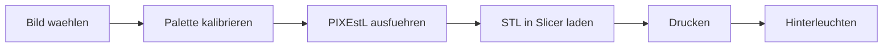

# PIXEstL - Farb-Lithophanie-Generator

**PIXEstL** verwandelt deine Fotos in beeindruckende, farbige Lithophanien fuer den 3D-Druck. Durch CMYK-basierte additive Farbmischung mit transparenten Filamenten entstehen hinterleuchtete Kunstwerke mit erstaunlicher Farbtiefe.

[Schnellstart](schnellstart.md){.md-button .md-button--primary}
[Installation](installation.md){.md-button}

---

## Was ist eine Farb-Lithophanie?

Eine Lithophanie ist ein duenner, lichtdurchlaessiger 3D-Druck, der erst durch Hintergrundbeleuchtung sein Bild zeigt. PIXEstL geht einen Schritt weiter: Durch das Stapeln transparenter Filamente in Cyan, Magenta, Gelb und Weiss entstehen **echte Farbbilder** - aehnlich wie beim klassischen CMYK-Druck, nur dreidimensional.

---

## Features

-   ** CMYK-Farbmischung **

    ---

    Additive Farbmischung mit transparenten Filamenten erzeugt tausende Farbtoene aus nur 4-8 Grundfarben.

-   ** Hochperformant **

    ---

    In Rust geschrieben mit paralleler Verarbeitung (Rayon). 2-3x schneller als die Java-Vorgaengerversion.

-   ** AMS-Unterstuetzung **

    ---

    Volle Unterstuetzung fuer Bambu Lab AMS mit automatischer Farbgruppen-Aufteilung (4/8/16 Farben).

-   **Kalibrierbar**

    ---

    Eigene Filament-Paletten fuer exakte Farbreproduktion mit jedem Drucker und Filament-Hersteller.

---

## Beispiele

{ width="300" }

{ width="300" }

{ width="300" }

[Mehr Beispiele in der Galerie](galerie.md){ .md-button }

---

## Workflow-Uebersicht

1. **[Kalibrierung](anleitung/kalibrierung.md)** - Filament-Farben messen und Palette erstellen
2. **[Generierung](anleitung/generierung.md)** - Bild mit PIXEstL in STL-Dateien umwandeln
3. **[Slicer](anleitung/slicer.md)** - STL-Dateien in Bambu Studio einrichten
4. **[Druck](anleitung/druck.md)** - Drucken und hinterleuchten
