# PIXEstL – Farb-Lithophanie-Generator

**PIXEstL** verwandelt deine Fotos in hinterleuchtete Farbbilder aus dem 3D-Drucker.
Durch clevere Farbmischung aus transparenten Filamenten entstehen Kunstwerke, die im Dunkeln erstrahlen.

[Jetzt loslegen](schnellstart.md){ .md-button .md-button--primary }
 
[Installation](installation/windows.md){ .md-button }
 
[Galerie ansehen](galerie.md){ .md-button }

---

## Was macht PIXEstL besonders?

-   **CMYK-Farbmischung**

    ---

    Wie beim klassischen Vierfarbdruck werden Cyan, Magenta, Gelb und Weiß zu tausenden Farbtönen gemischt – nur eben in 3D und aus transparentem Filament.

-   **Bambu Lab AMS-Unterstützung**

    ---

    Volle Unterstützung für das Automatic Material System (AMS). PIXEstL teilt die Farben automatisch in Gruppen auf, die perfekt in 1, 2 oder 4 AMS-Einheiten passen.

-   **Hochperformant**

    ---

    In Rust geschrieben mit paralleler Verarbeitung über alle CPU-Kerne. Typische Bilder werden in Sekunden verarbeitet – 2–3× schneller als die Java-Vorgängerversion.

---

## So funktioniert es – in 5 Schritten

```mermaid
graph LR
    A["📷 Foto wählen"] --> B["🎨 Palette kalibrieren"]
    B --> C["⚙️ PIXEstL ausführen"]
    C --> D["🖨️ Slicer einrichten"]
    D --> E["✅ Drucken & beleuchten"]
```

| Schritt | Was passiert | Mehr erfahren |
|---------|-------------|---------------|
| **1. Palette kalibrieren** | Du misst einmalig, wie deine Filamente hinterleuchtet aussehen, und trägst die Werte in eine JSON-Datei ein. | [Kalibrierung →](anleitung/kalibrierung.md) |
| **2. Bild vorbereiten** | Du wählst ein passendes Foto und optimierst es kurz (Kontrast, Ausschnitt, Größe). | [Bild vorbereiten →](anleitung/bild-vorbereiten.md) |
| **3. PIXEstL ausführen** | Ein einzelner Befehl rechnet das Bild in mehrere STL-Dateien um – je eine pro Filamentfarbe. | [Generierung →](anleitung/generierung.md) |
| **4. Slicer einrichten** | Du lädst die STL-Dateien in Bambu Studio und weist jeder Datei das richtige Filament zu. | [Slicer →](anleitung/slicer.md) |
| **5. Drucken & beleuchten** | Der Drucker übernimmt – danach einfach eine Lichtquelle dahinter und staunen. | [Drucken →](anleitung/druck.md) |

---

## Beispiele

{ width="300" loading=lazy }
&nbsp;
{ width="300" loading=lazy }
&nbsp;
{ width="300" loading=lazy }

[Alle Beispiele in der Galerie →](galerie.md){ .md-button }
