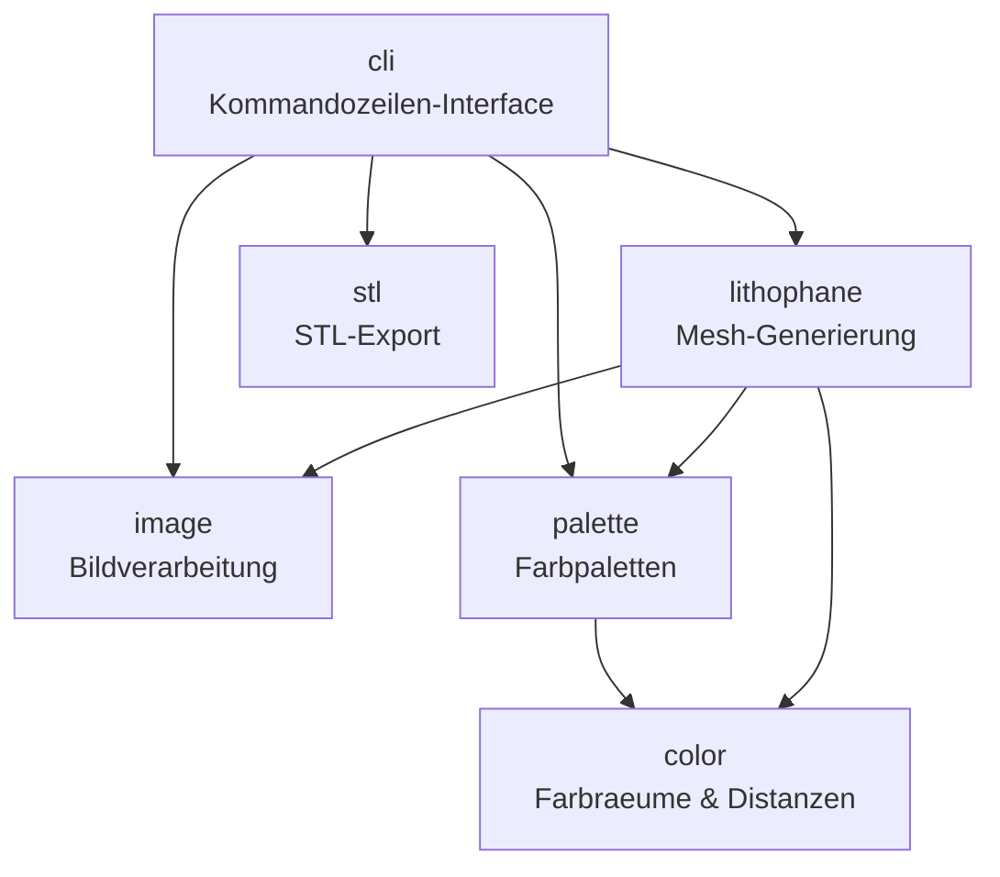
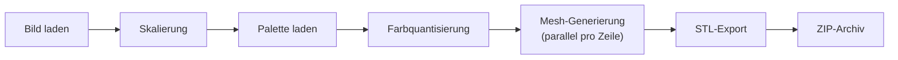
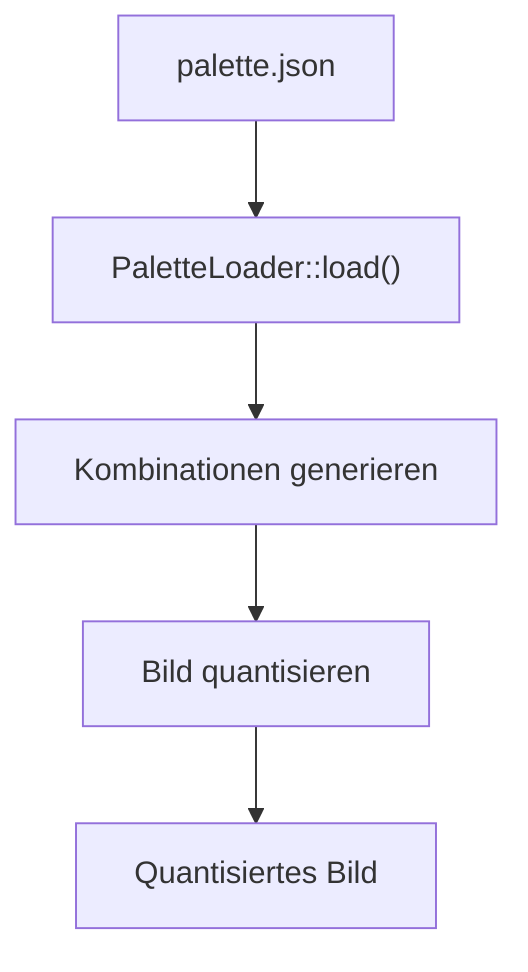
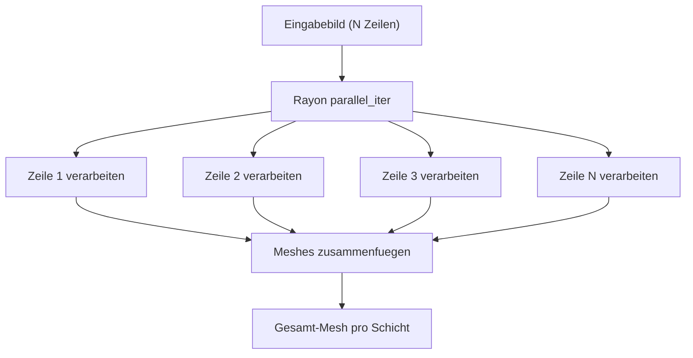

# Technische Architektur

Diese Seite beschreibt die interne Architektur von PIXEstL fuer Entwickler und technisch Interessierte.

---

## Moduluebersicht

PIXEstL ist in sechs klar getrennte Module aufgeteilt, die jeweils eine spezifische Aufgabe erfuellen:

| Modul         | Verzeichnis      | Aufgabe                                          |
|---------------|------------------|--------------------------------------------------|
| `cli`         | `src/cli/`       | Kommandozeilen-Parsing mit clap                  |
| `color`       | `src/color/`     | Farbraeume (RGB, HSL, CIE-Lab) und Distanzen     |
| `palette`     | `src/palette/`   | Paletten-Laden, Farbkombinationen, Quantisierung |
| `image`       | `src/image/`     | Bildladen, Skalierung, Transparenzerkennung      |
| `lithophane`  | `src/lithophane/`| Konfiguration, Mesh-Generierung, Geometrie       |
| `stl`         | `src/stl/`       | ASCII-/Binaer-STL-Export, ZIP-Verpackung          |

---

## Datenfluss

Der vollstaendige Verarbeitungsprozess von der Eingabe bis zur Ausgabe:

1. **Bild laden** - Eingabebild (JPG, PNG, WebP) wird gelesen und dekodiert
2. **Skalierung** - Das Bild wird auf die Zielgroesse in Millimetern umgerechnet
3. **Palette laden** - Filament-Definitionen aus der JSON-Palette einlesen
4. **Farbquantisierung** - Jeder Pixel wird der naechsten verfuegbaren Palettenfarbe zugeordnet
5. **Mesh-Generierung** - 3D-Geometrie wird parallel erzeugt (eine Zeile pro Thread)
6. **STL-Export** - Meshes werden als STL-Dateien geschrieben
7. **ZIP-Archiv** - Alle STL-Dateien werden in ein ZIP-Archiv gepackt

---

## Module im Detail

### `color/` - Farbraeume und Distanzen

Dieses Modul implementiert drei Farbraeume und die Konvertierung zwischen ihnen:

| Farbraum  | Felder          | Verwendung                            |
|-----------|-----------------|---------------------------------------|
| **RGB**   | R, G, B (0-255) | Ein-/Ausgabe, Bildverarbeitung        |
| **HSL**   | H, S, L         | Palette-Definitionen (Filament-Farben)|
| **CIE-Lab** | L, a, b       | Wahrnehmungstreue Farbdistanz         |

Die Farbdistanzberechnung unterstuetzt sowohl euklidische RGB-Distanz als auch die perceptuell gleichmaessige CIE-Lab-Distanz (Delta E).

### `palette/` - Farbpaletten

Das Palette-Modul hat drei Hauptaufgaben:

1. **Laden** - JSON-Paletten-Dateien einlesen und validieren
2. **Kombinationsgenerierung** - Alle gueltigen Farbkombinationen fuer die konfigurierte Schichtanzahl berechnen
3. **Bildquantisierung** - Eingabebild-Pixel den naechsten Palettenfarben zuordnen

### `image/` - Bildverarbeitung

Verantwortlich fuer:

- **Bildladen** - Unterstuetzt JPEG, PNG, WebP und weitere Formate ueber die `image`-Crate
- **Skalierung** - Anpassung an die Ziel-Millimetergroesse
- **Transparenzerkennung** - Erkennung von Alpha-Kanaelen fuer korrekte Verarbeitung
- **Graustufenkonvertierung** - Fuer die Texturschicht (Helligkeitsinformation)

### `lithophane/` - Mesh-Generierung

Das Kernmodul mit folgenden Unterkomponenten:

| Komponente        | Datei                | Aufgabe                                        |
|-------------------|----------------------|------------------------------------------------|
| **Config**        | `config.rs`          | Alle Konfigurationsparameter                   |
| **Generator**     | `mod.rs`             | Orchestrierung der Gesamtgenerierung           |
| **ColorLayer**    | `color_layer.rs`     | Farbschichten mit RLE + Quader-Mesh            |
| **TextureLayer**  | `texture_layer.rs`   | Texturschicht mit triangulierten Hoehenprofilen |
| **SupportPlate**  | `support_plate.rs`   | Grundplatte unter allen Schichten              |
| **Geometry**      | `geometry.rs`        | Mesh, Triangle, Vector3 - Basis-Geometrie      |

!!! note "Run-Length Encoding (RLE)"
    Benachbarte Pixel gleicher Farbe werden zu einem einzigen breiteren Quader zusammengefasst. Dies reduziert die Anzahl der Dreiecke erheblich und fuehrt zu kleineren STL-Dateien.

### `stl/` - STL-Export

Unterstuetzt zwei Exportformate:

| Format     | Vorteil                 | Nachteil             | Flag               |
|------------|-------------------------|----------------------|---------------------|
| **ASCII**  | Menschenlesbar, Debug   | Groessere Dateien    | `--format ascii`    |
| **Binary** | Kompakt, schneller      | Nicht lesbar         | `--format binary`   |

Die exportierten STL-Dateien werden abschliessend in ein ZIP-Archiv gepackt.

### `cli/` - Kommandozeilen-Interface

Basiert auf der `clap`-Crate mit dem Derive-Macro. Alle Parameter werden typsicher geparst und in die interne Konfiguration (`LithophaneConfig`) umgewandelt. Siehe die [CLI-Referenz](../cli-referenz.md) fuer alle verfuegbaren Optionen.

---

## Parallelisierung

PIXEstL nutzt **Rayon** fuer datenparallele Verarbeitung auf Zeilenebene.

### Prinzip

- Jede Bildzeile wird **unabhaengig** von den anderen verarbeitet
- Rayon verteilt die Zeilen automatisch auf alle verfuegbaren CPU-Kerne
- Nach der parallelen Verarbeitung werden die Teil-Meshes zu einem Gesamt-Mesh zusammengefuegt
- Die Anzahl der genutzten Threads entspricht standardmaessig der Anzahl der CPU-Kerne

!!! tip "Performance"
    Auf einem 8-Kern-Prozessor ist die Generierung typischerweise 5-7x schneller als bei sequentieller Verarbeitung.

---

## Algorithmen

### Farbquantisierung

Fuer jeden Pixel im Eingabebild wird die naechste verfuegbare Palettenfarbe ermittelt:

1. Zielfarbe des Pixels in den CIE-Lab-Farbraum konvertieren
2. Distanz zu jeder Palettenfarbe berechnen (Delta E)
3. Palettenfarbe mit der **kleinsten Distanz** waehlen
4. Zugehoerige Farbschicht-Kombination dem Pixel zuweisen

### Run-Length Encoding (RLE)

Optimierung der Farbschichten fuer kleinere STL-Dateien:

1. Zeile von links nach rechts durchlaufen
2. Aufeinanderfolgende Pixel **gleicher Farbe** zaehlen
3. Statt einzelner Quader pro Pixel einen **zusammengefassten breiten Quader** erzeugen
4. Reduziert die Dreiecksanzahl um typischerweise 40-70%

### Mesh-Generierung

Zwei unterschiedliche Strategien je nach Schichttyp:

| Schichttyp    | Geometrie              | Beschreibung                                    |
|---------------|------------------------|-------------------------------------------------|
| **Farbschicht** | Quader (Cubes)       | Gleichmaessig hohe Bloecke, Farbe durch Filament |
| **Texturschicht** | Trianguliertes Hoehenprofil | Variable Hoehe je nach Pixel-Helligkeit     |

---

## Abhaengigkeiten

Die wichtigsten externen Abhaengigkeiten von PIXEstL:

| Crate              | Version | Zweck                                         |
|--------------------|---------|-----------------------------------------------|
| `clap`             | 4       | Kommandozeilen-Parsing                        |
| `image`            | 0.25    | Bildladen und -verarbeitung                   |
| `rayon`            | 1.10    | Datenparallele Verarbeitung                   |
| `nalgebra`         | 0.34    | Lineare Algebra / Vektoroperationen           |
| `stl_io`           | 0.10    | STL-Datei-Schreiben                           |
| `serde` / `serde_json` | 1   | JSON-Serialisierung (Paletten)                |
| `thiserror`        | 2       | Ergonomische Fehlertypen                      |
| `anyhow`           | 1       | Fehlerbehandlung auf Anwendungsebene          |
| `zip`              | 8       | ZIP-Archiv-Erstellung                         |
| `tracing`          | 0.1     | Strukturiertes Logging                        |
| `num_cpus`         | 1       | CPU-Kern-Erkennung                            |
