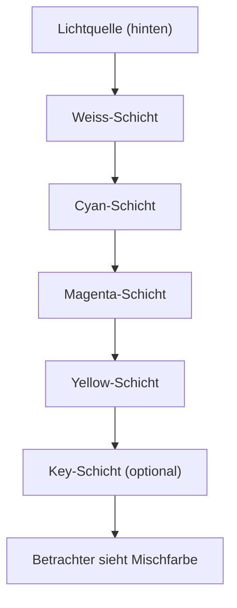
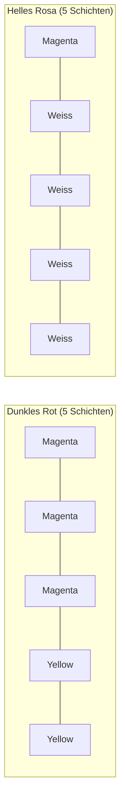

# CMYK Farbmischung

PIXEstL erzeugt farbige Lithophanien durch CMYK-Farbmischung mit transparenten Filamenten. Diese Seite erklaert die zugrunde liegenden Prinzipien.

---

## Grundprinzip

Traditionelle Lithophanien sind **monochrom** (Graustufen). Die Helligkeit eines Pixels wird ausschliesslich ueber die Materialdicke gesteuert: Duenne Bereiche lassen mehr Licht durch und erscheinen hell, dicke Bereiche erscheinen dunkel.

PIXEstL geht einen entscheidenden Schritt weiter: Durch das Stapeln **transparenter Filamente** in den CMYK-Grundfarben entstehen echte Farbbilder. Wenn Licht von hinten durch die gestapelten Schichten faellt, mischen sich die Farben subtraktiv - aehnlich wie beim klassischen Offsetdruck.

!!! info "Subtraktive Farbmischung"
    Bei der subtraktiven Farbmischung absorbiert jede Farbschicht einen Teil des Lichtspektrums. Cyan absorbiert Rot, Magenta absorbiert Gruen, Gelb absorbiert Blau. Durch Kombination der Schichten entstehen beliebige Farben.

---

## CMYK erklaert

CMYK steht fuer die vier Grundfarben:

| Abkuerzung | Farbe   | Funktion                          |
|------------|---------|-----------------------------------|
| **C**      | Cyan    | Absorbiert rotes Licht            |
| **M**      | Magenta | Absorbiert gruenes Licht          |
| **Y**      | Yellow  | Absorbiert blaues Licht           |
| **K**      | Key     | Schwarz - absorbiert alles Licht  |

In PIXEstL wird jede dieser Farben durch ein separates transparentes Filament repraesentiert. Die Schichten werden uebereinander gedruckt. Wenn das fertige Objekt hinterleuchtet wird, durchdringt das Licht alle Schichten und die Farben vermischen sich im Auge des Betrachters.



---

## Additive Methode

Die **additive Methode** ist das Standardverfahren in PIXEstL und erzeugt die groesste Farbvielfalt.

### Funktionsweise

Fuer jeden Pixel werden mehrere Farbschichten gestapelt. Die Gesamtzahl der Schichten ist konfigurierbar (Standard: 5). Die CMYK-Werte der einzelnen Schichten werden **aufaddiert**, um die Zielfarbe zu erreichen.

!!! example "Beispiel: Helles Cyan"
    Fuer ein helles Cyan bei 5 Gesamtschichten:

    | Schicht | Filament |
    |---------|----------|
    | 1       | Cyan     |
    | 2       | Cyan     |
    | 3       | Weiss    |
    | 4       | Weiss    |
    | 5       | Weiss    |

    Ergebnis: 2x Cyan + 3x Weiss = helles, leicht transparentes Cyan.

!!! example "Beispiel: Dunkles Violett"
    | Schicht | Filament |
    |---------|----------|
    | 1       | Cyan     |
    | 2       | Cyan     |
    | 3       | Magenta  |
    | 4       | Magenta  |
    | 5       | Magenta  |

    Ergebnis: 2x Cyan + 3x Magenta = dunkles Violett.

### Vorteile

- Grosse Farbvielfalt aus wenigen Filamenten
- Feine Farbabstufungen moeglich
- Bessere Farbtreue bei fotorealistischen Bildern

---

## Full-Pixel Methode

Die **Full-Pixel Methode** ist eine einfachere Alternative.

### Funktionsweise

Bei dieser Methode besteht jeder Pixel aus **genau einer Filamentfarbe**. Alle Schichten eines Pixels verwenden dasselbe Filament. Es findet keine Mischung zwischen verschiedenen Farben statt.

!!! example "Beispiel"
    Fuer einen Cyan-Pixel bei 5 Gesamtschichten:

    | Schicht | Filament |
    |---------|----------|
    | 1       | Cyan     |
    | 2       | Cyan     |
    | 3       | Cyan     |
    | 4       | Cyan     |
    | 5       | Cyan     |

### Vorteile und Einschraenkungen

| Eigenschaft       | Full-Pixel              | Additive                |
|--------------------|------------------------|-------------------------|
| Farbanzahl         | Begrenzt (nur Grundfarben) | Viele Mischfarben    |
| Komplexitaet       | Gering                 | Hoeher                  |
| Druckqualitaet     | Gleichmaessig          | Farbuebergaenge moeglich |
| Konfiguration      | `--pixel-method full`  | `--pixel-method additive` |

---

## Farbabstandsmessung

Um fuer jeden Pixel die bestmoegliche Farbe aus der Palette zu finden, muss PIXEstL den **Abstand** zwischen der Zielfarbe und den verfuegbaren Palettenfarben berechnen. Dafuer stehen zwei Methoden zur Verfuegung.

### RGB-Distanz

Die einfachste Methode: Euklidischer Abstand im RGB-Farbraum.

```
distanz = sqrt((R1 - R2)^2 + (G1 - G2)^2 + (B1 - B2)^2)
```

| Eigenschaft       | Bewertung        |
|--------------------|-----------------|
| Geschwindigkeit    | Sehr schnell    |
| Genauigkeit        | Maessig         |
| Wahrnehmungstreue  | Niedrig         |

!!! warning "Einschraenkung"
    Der RGB-Farbraum ist **nicht wahrnehmungsgleichmaessig**. Gleiche numerische Distanzen koennen sehr unterschiedlich wahrgenommen werden. Gruene Toene werden beispielsweise feiner unterschieden als blaue.

### CIE-Lab-Distanz (Standard)

Die CIE-Lab-Methode arbeitet im **wahrnehmungsgleichmaessigen** CIE-Lab-Farbraum. Farben, die fuer das menschliche Auge aehnlich aussehen, haben kleine Distanzen - unabhaengig vom Farbton.

Der Abstand wird ueber die Delta-E-Formel berechnet:

$$
\Delta E = \sqrt{(L_1 - L_2)^2 + (a_1 - a_2)^2 + (b_1 - b_2)^2}
$$

Dabei stehen die Komponenten fuer:

| Komponente | Bedeutung                                      |
|------------|-------------------------------------------------|
| **L**      | Helligkeit (Lightness): 0 = Schwarz, 100 = Weiss |
| **a**      | Gruen-Rot-Achse: negativ = Gruen, positiv = Rot  |
| **b**      | Blau-Gelb-Achse: negativ = Blau, positiv = Gelb  |

!!! tip "Empfehlung"
    CIE-Lab ist der **Standard und empfohlene** Modus (`--color-distance cie-lab`). Er liefert deutlich bessere Ergebnisse bei der Farbzuordnung, besonders bei Hauttoenen und feinen Farbverlaeufen.

---

## Warum Weiss?

Weisses Filament spielt eine zentrale Rolle in der additiven Methode: Es dient als **Fuellmaterial**.

Da jeder Pixel aus einer festen Anzahl von Schichten besteht (Standard: 5), muessen nicht immer alle Schichten eingefaerbt sein. Weiss fuellt die verbleibenden Schichten auf, damit die Gesamtdicke konstant bleibt.



!!! warning "Pflicht in der additiven Methode"
    In der additiven Methode ist Weiss **zwingend erforderlich**. Ohne Weiss als Fuellfarbe koennte PIXEstL keine hellen Toene erzeugen. Stelle sicher, dass deine Palette immer ein weisses Filament enthaelt.

---

## Farbkombinationen

Bei der additiven Methode generiert PIXEstL **alle gueltigen Kombinationen** aus den verfuegbaren Farben fuer die konfigurierte Schichtanzahl.

### Beispiel: 5 Schichten mit CMYK + Weiss

Mit 5 Schichten und 5 moeglichen Farben (C, M, Y, K, W) ergeben sich Kombinationen wie:

| Cyan | Magenta | Yellow | Key | Weiss | Ergebnis           |
|------|---------|--------|-----|-------|--------------------|
| 0    | 0       | 0      | 0   | 5     | Reines Weiss       |
| 5    | 0       | 0      | 0   | 0     | Sattes Cyan        |
| 2    | 0       | 0      | 0   | 3     | Helles Cyan        |
| 1    | 1       | 1      | 0   | 2     | Helles Grau        |
| 2    | 2       | 0      | 0   | 1     | Blau-Violett       |
| 0    | 3       | 2      | 0   | 0     | Rot-Orange         |
| 1    | 0       | 2      | 1   | 1     | Oliv-Gruen         |
| 0    | 0       | 0      | 5   | 0     | Tiefschwarz        |

!!! note "Gesamtzahl der Kombinationen"
    Die Anzahl der moeglichen Kombinationen entspricht der Anzahl der Moeglichkeiten, `n` Schichten auf `k` Farben zu verteilen. Fuer 5 Schichten und 5 Farben sind das 126 eindeutige Kombinationen. Nicht alle erzeugen visuell unterscheidbare Farben - PIXEstL waehlt automatisch die beste Uebereinstimmung fuer jeden Pixel.
